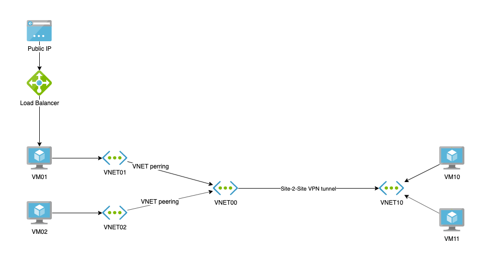

# Challenge

Refer to the diagram below.

You need to run the following Virtual Machines:

- VM01 - a web server which hosts a website on port 80
- VM02 - a database server which runs MS SQL with default instance configuration
- VM10 - a management VM used by IT staff to manage the landscape
- VM11 - a file server hosting source files

All VMs run Windows Server 2016/2019 OS.

You need to deploy the following network topology:

- VNET01 connected to VNET00 with VNET peering
- VNET02 connected to VNET00 with VNET peering
- VNET10 connected to VNET00 with a site-to-site IPSec VPN tunnel

The following connectivity requirements must be met:

- VM01 can be reached from public Internet only on port 80 TCP, via a Load Balancer
- VM01 can only connect to:
  - VM02 for database access
  - VM11 for file share access over SMB 3.0
- VM02 an only connect to:
  - VM11 for file share access over SMB 3.0
- VM10 can connect to all other VMs using Remote Desktop and PowerShell
- VM11 cannot connect to any other VMs in the landscape
- Internet access must be inspected and filtered:
  - VM01 can only access the endpoint crl.microsoft.com (using fqdn filtering not IP filtering)
  - VM10 can only access Internet endpoints on ports TCP80 and TCP443
  - VM02 and VM11 cannot access Internet at all

For any details not specified above chose the solution which you believe to be the best fit. Make sure that the setup is as secure and as elegant as possible. For an extra challenge use ARM templates and Azure DevOps Pipelines.

Deploy the VMs and test connectivity.

For VM02 you can use MS SQL Express, get it here: https://www.microsoft.com/en-us/sql-server/sql-server-editions-express. Ideally download it from VM10, place it in a file share hosted on VM11 and install on VM02 from the file share.
